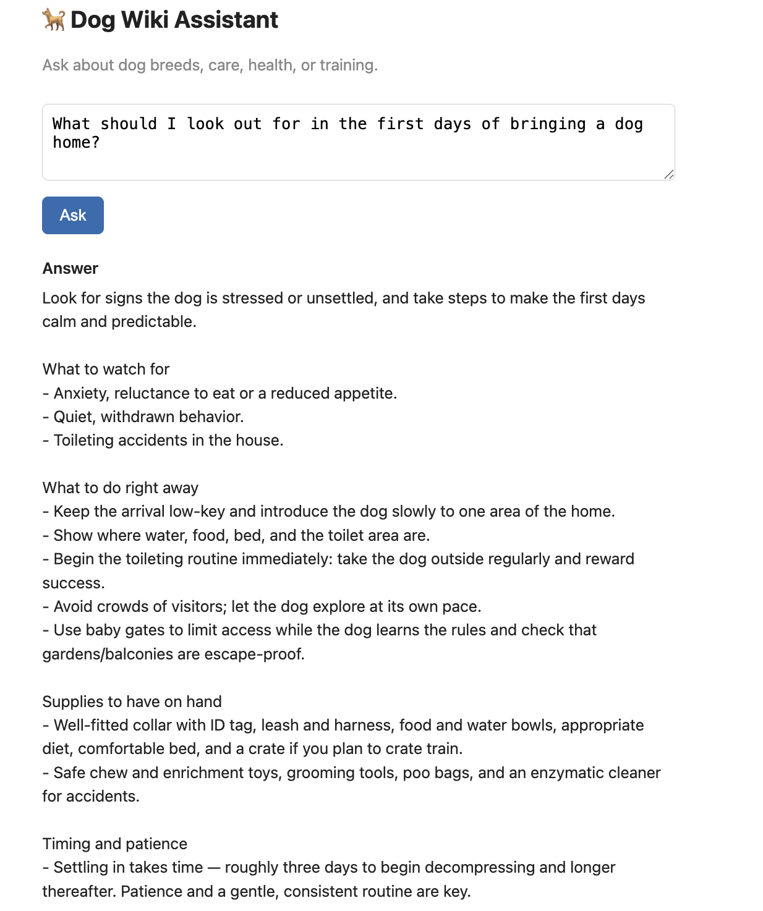
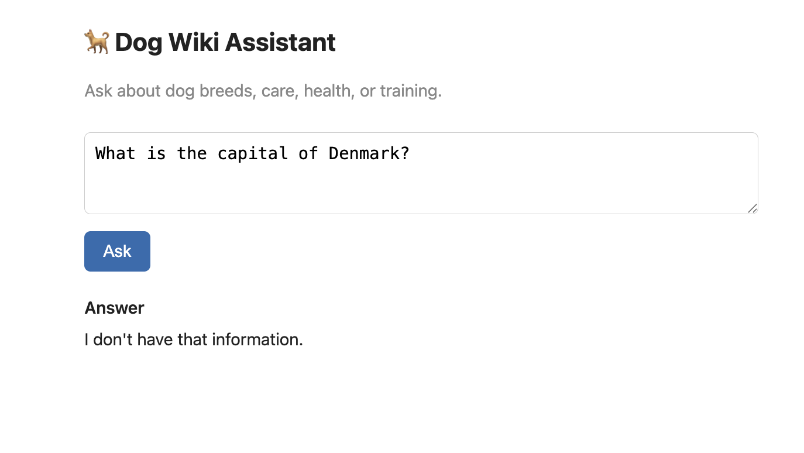

# 🐕 Dog Wiki Assistant

A retrieval-augmented generation (RAG) assistant that answers questions about
dogs — breeds, care, health, and training — grounded in a custom knowledge base
rather than the language model's general memory. Ask a question in the browser
and get a clear, practical answer drawn only from the underlying documents.

Built from scratch as a learning project to understand the full RAG pipeline
end to end: chunking, embeddings, vector search, grounded generation, and a
containerized frontend/backend setup.

For diagrams of how the pipeline and containers fit together, see the [architecture doc](docs/architecture.md).

## Features

- **Grounded answers** — responses come only from the knowledge base; the
  assistant declines questions it has no information for instead of guessing.
- **Semantic retrieval** — questions are matched to relevant content by meaning,
  not keywords, using OpenAI embeddings and a Chroma vector database.
- **Separate frontend and backend** — a static frontend talks to a FastAPI
  backend over HTTP (with CORS), mirroring a real web architecture.
- **Fully containerized** — the whole app runs with a single `docker compose up`.
- **Measured retrieval quality** — a small evaluation suite reports retrieval
  hit-rate over a hand-built test set.

## Tech stack

- **Python**, **FastAPI** (backend API)
- **OpenAI API** — `text-embedding-3-small` (embeddings) and `gpt-5-mini` (generation)
- **ChromaDB** — persistent vector store
- **HTML / JavaScript** — lightweight frontend, served by **nginx**
- **Docker + Docker Compose** — containerization

## Screenshot

**Answering from the knowledge base:**


**Declining an out-of-scope question:**


## Getting started

### Prerequisites
- [Docker Desktop](https://www.docker.com/products/docker-desktop/) installed and running
- An OpenAI API key

### Setup
1. Clone the repository:
   ```
   git clone https://github.com/rachanapatel28/rag_dog_assistant.git
   cd dog-rag-assistant
   ```
2. Create a `.env` file in the project root with your API key:
   ```
   OPENAI_API_KEY=sk-your-key-here
   ```
3. Build the knowledge base (chunks + embeddings, then load into Chroma):
   ```
   python build_index.py
   python load_to_chroma.py
   ```
4. Start the app:
   ```
   docker compose up --build
   ```
5. Open **http://localhost:8080** in your browser.

## How it works

The assistant follows the standard RAG pattern:

1. **Chunking** — the source documents in `data/` are split into overlapping
   text chunks (`chunk_docs.py`).
2. **Embedding** — each chunk is turned into a vector that captures its meaning
   (`build_index.py`), and the vectors are stored in Chroma (`load_to_chroma.py`).
3. **Retrieval** — an incoming question is embedded the same way, and Chroma
   returns the most similar chunks (`search.py`).
4. **Generation** — the retrieved chunks are passed to the language model as
   context, with instructions to answer only from that context (`ask.py`).
5. **Serving** — a FastAPI backend (`main.py`) exposes an `/ask` endpoint, and a
   static frontend (`frontend/`) calls it from the browser.

## Project structure

```
.
├── backend/
│   ├── data/                 # the knowledge base (text documents)
│   ├── eval/                 # evaluation test set
│   ├── chunk_docs.py         # split documents into chunks
│   ├── build_index.py        # create embeddings
│   ├── load_to_chroma.py     # load embeddings into Chroma
│   ├── search.py             # semantic retrieval
│   ├── ask.py                # retrieval + grounded answer generation
│   ├── main.py                # FastAPI backend
│   ├── evaluate_retrieval.py # retrieval evaluation
│   ├── requirements.txt
│   └── Dockerfile
├── frontend/
│   ├── index.html            # static HTML/JS frontend
│   └── Dockerfile
├── docs/                     # screenshots and documentation
└── compose.yml               # runs backend + frontend together
```

## Evaluation

Retrieval is evaluated against a hand-built test set of questions (including
messy, natural-phrasing and ambiguous queries) by checking whether an expected
source document appears in the top-k retrieved chunks:

```
python evaluate_retrieval.py
```

## Notes

This is a personal learning project. The dog-care information in the knowledge
base is general and not a substitute for professional veterinary advice.