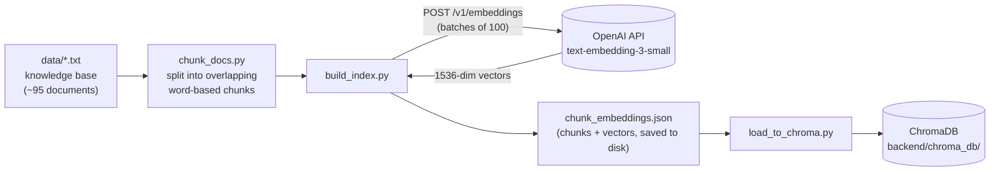
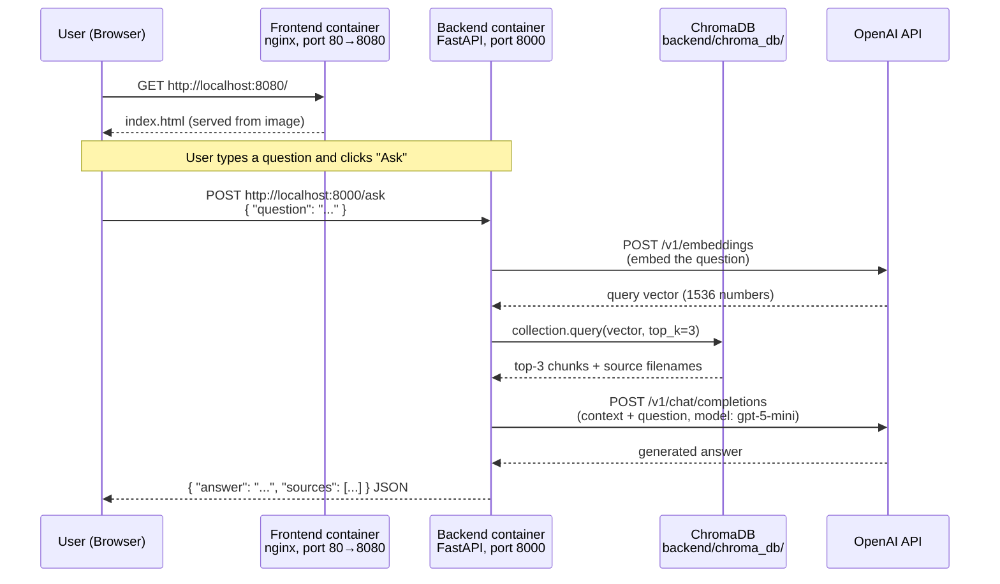
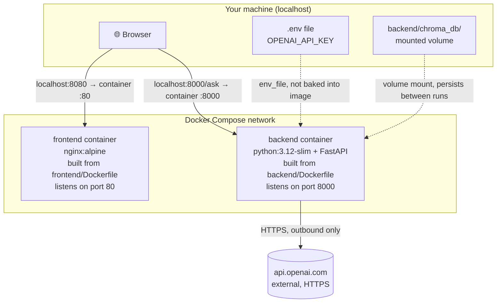

# Architecture

This document explains how the Dog Wiki Assistant is built internally: how the
knowledge base becomes searchable, what happens when a question is asked, and
how the Docker containers, ports, and the OpenAI API fit together.

There are two distinct phases: **indexing** (done once, offline, whenever the
knowledge base changes) and **querying** (done every time a user asks a
question).

## 1. Indexing pipeline (offline)

Turns the raw `.txt` documents into a searchable vector database.

Run once with `python build_index.py` followed by `python load_to_chroma.py`
(from inside `backend/`), and again any time the documents in `data/` change.
This is the only step that calls OpenAI's **embeddings** endpoint.

## 2. Query flow (runtime)

What happens, in order, when a user types a question into the page.

Two things worth noting:

- **The browser calls the backend directly**, not through the frontend
  container. The frontend's only job is to serve the static page; the page's
  own JavaScript then talks straight to `http://localhost:8000`. This is
  exactly why **CORS** has to be configured on the backend — the browser sees
  the page (origin `:8080`) and the API (origin `:8000`) as two different
  origins.
- Every question makes **two** calls to OpenAI: one to embed the question
  (cheap), one to generate the answer (the main cost).

## 3. Docker containers, ports, and networking

How the two services are packaged and how traffic reaches them.

### Port mapping

| Service  | Host address            | Container port | Maps to |
|----------|--------------------------|-----------------|---------|
| frontend | `http://localhost:8080` | 80               | nginx serving `index.html` |
| backend  | `http://localhost:8000` | 8000             | FastAPI (`uvicorn`) |

`compose.yml`'s `ports: "8080:80"` and `"8000:8000"` mean **host:container** —
the first number is what you type in your browser; the second is what the
process inside the container actually listens on.

### Why the API key and the database aren't inside the image

Two deliberate design choices:

- **`.env` is never copied into the backend image** (`.dockerignore` blocks
  it). The key is injected at *run time* via `env_file` in `compose.yml`, so
  the image itself contains no secrets and could be shared safely.
- **`chroma_db/` is a mounted volume, not part of the image.** The image
  contains only code; the actual vector database lives on the host and is
  attached when the container starts. This also means the database survives
  container restarts and rebuilds.

### OpenAI endpoints used

| Endpoint                     | Called from        | When                              | Model                     |
|-------------------------------|---------------------|-------------------------------------|----------------------------|
| `POST /v1/embeddings`         | `build_index.py`, `search.py` | Indexing, and once per user question | `text-embedding-3-small`  |
| `POST /v1/chat/completions`   | `ask.py`            | Once per user question (generation) | `gpt-5-mini`               |

Both are standard OpenAI REST endpoints, called over HTTPS from inside the
backend container — outbound only; nothing external calls *into* the
container except through the mapped ports above.